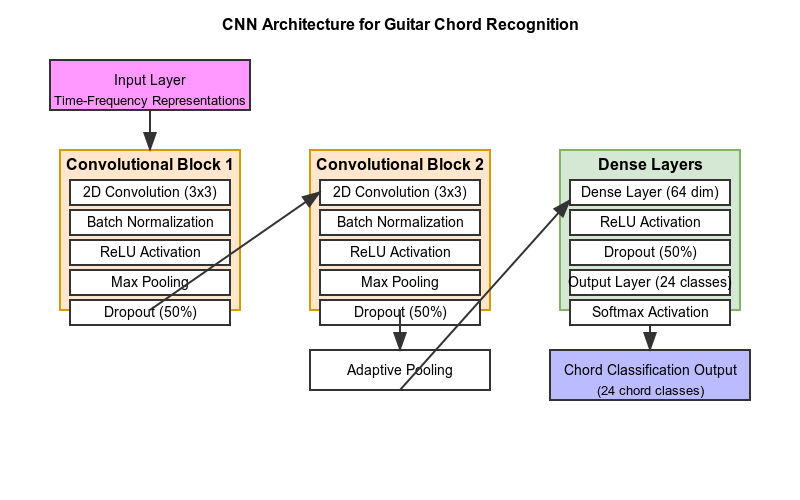

# Guitar Chord Recognition System: Algorithm-Based Approach

## Project Overview
This project implements a CNN-based system for recognizing guitar chords from audio recordings. The system can identify 24 different chord types (major and minor chords across all 12 keys) with 93.64% accuracy using a convolutional neural network architecture optimized for audio classification.

## Technical Pipeline

### 1. Data Processing & Augmentation
The system employs robust data augmentation to expand the training dataset:

- **Pitch Shifting**: Subtle shifts (±15, ±30 cents) that preserve chord identity
- **Time Stretching**: Speed variations (0.95x, 1.05x) to simulate different playing styles
- **Noise Addition**: Low-level noise for robustness against recording variations
- **Organization**: Augmented files are stored in a structured directory format by chord type

This augmentation increases dataset size by 7x per sample, enabling better generalization.

### 2. Feature Extraction
The project uses specialized audio feature extraction optimized for chord recognition (saved as 2D numpy arrays):

- **Chromagram Features**: High-resolution (36 bins per octave) constant-Q transform to capture pitch relationships
- **Harmonic-Percussive Separation**: Isolates harmonic content for cleaner chord representation
- **Tonnetz Features**: Captures harmonic relationships between notes
- **Onset Detection**: Identifies attack characteristics of guitar chords

These features are standardized and padded to create a consistent representation for the neural network.

### 3. Model Architecture

The system employs a specialized **Convolutional Neural Network (CNN)** architecture optimized for audio spectral data.
 
Convolutional Neural Networks process grid-like data through sliding filter windows that detect patterns across the input. Each filter activates (ReLU) when encountering specific features, creating feature maps that highlight where patterns occur. This hierarchical feature extraction makes CNNs ideal for spectrograms and chromagrams, where harmonic structures create distinctive visual patterns across time and frequency dimensions.

- **Input Layer**: Accepts time-frequency representations (spectrograms/chromagrams) as 2D matrices
- **Convolutional Blocks**: Two sequential blocks each containing:
  
  - **2D Convolution** (3×3 kernels): Detects frequency patterns and harmonic structures
  - **Batch Normalization**: Stabilizes learning by normalizing layer activations (each layer has the same amount of data working through it).
  - **ReLU Activation**: Introduces non-linearity for complex pattern detection
  - **Max Pooling**: Reduces dimensions while preserving dominant frequencies
  - **Dropout (50%)**: Prevents co-adaptation of features for better generalization

- **Adaptive Pooling**: Standardizes feature map sizes regardless of input length
- **Dense Layers**: Fully-connected layers with progressive dimensionality reduction:
  - First dense layer with ReLU activation maps extracted features to 64 dimensions
  - Heavy dropout (50%) prevents overfitting on limited training data
  - Final classification layer with **softmax** outputs probabilities across 24 chord classes
    - Each output neuron gets assigned a probability
    - The chord with highest probability becomes the prediction
    - Allows the model to express uncertainty between similar chords

This architecture effectively leverages the visual pattern-like nature of spectral representations, where chord structures create distinctive activation patterns across frequency bands. The relatively shallow design (only 2 convolutional layers) balances representational capacity with the limited dataset size, while extensive regularization techniques prevent overfitting.

### 4. Training Methodology
The training process employs:

- **Class Weighting**: Compensates for imbalance in chord examples
- **Learning Rate Scheduling**: Reduces learning rate when improvement plateaus
- **Early Stopping**: Prevents overfitting by monitoring validation performance
- **Gradient Descent**: Adam optimizer with weight decay for regularization

### 5. Model Performance
The model achieves exceptional performance metrics:

- **Overall Accuracy**: 93.64% on test data
- **Per-Chord Performance**: Strong recognition across all chord types
- **Confusion Matrix**: Minimal confusion between similar-sounding chords
- **F1-Scores**: Most chords have F1-scores above 0.90 (how many were actually true)

### 6. Chord Recognition System
The final system includes a robust chord recognition function that:

- Takes any WAV file as input
- Extracts the same features used in training
- Returns the most likely chord with confidence score
- Provides alternative options with their confidence levels

## Implementation Details
The preprocessing pipeline standardizes each recording by:
1. Converting to mono
2. Extracting chromagram & harmonic features
3. Padding to consistent dimensions
4. Feeding through the CNN model

Each chord prediction includes confidence levels to indicate prediction reliability.