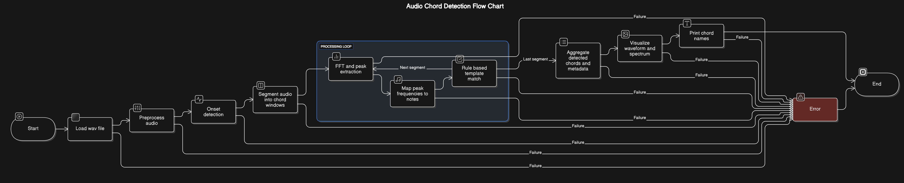
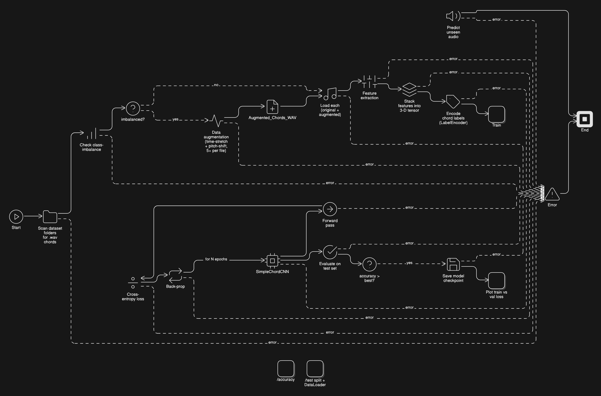
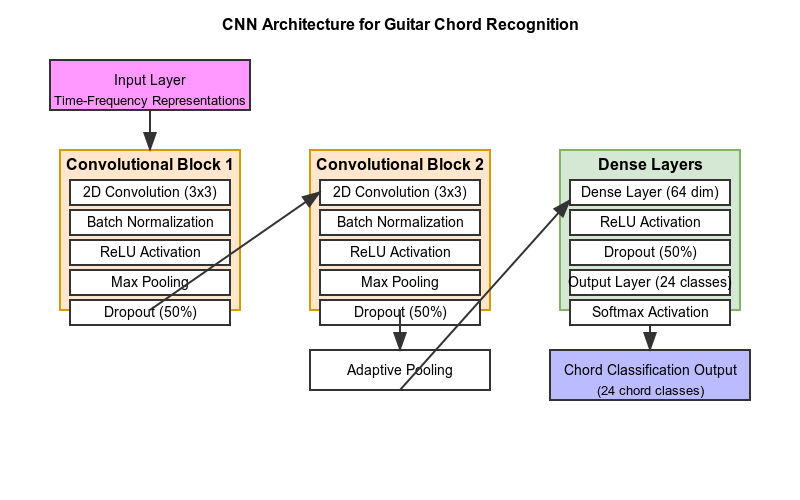
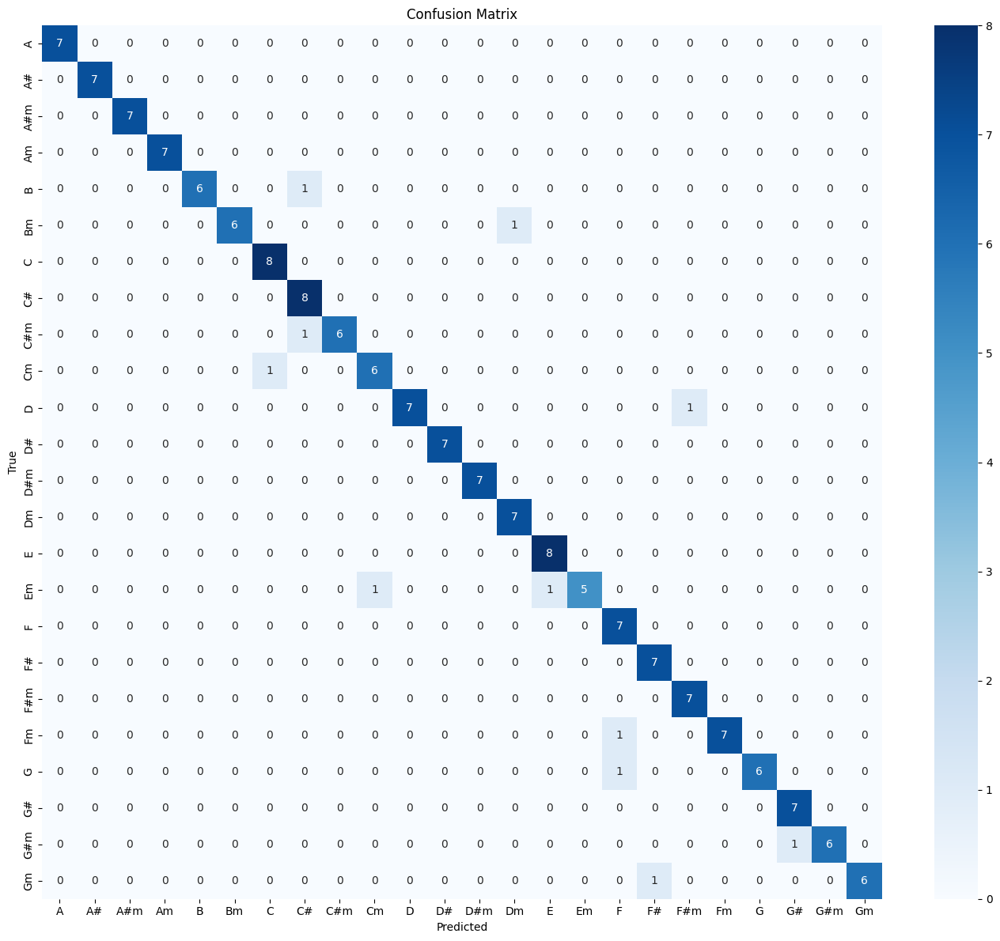
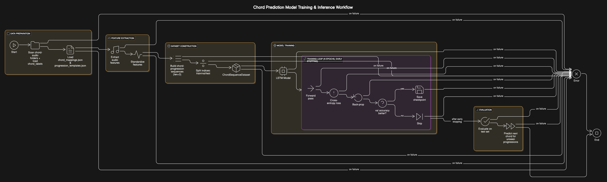
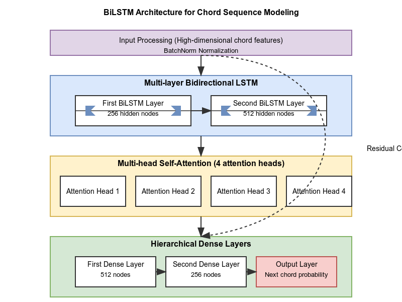
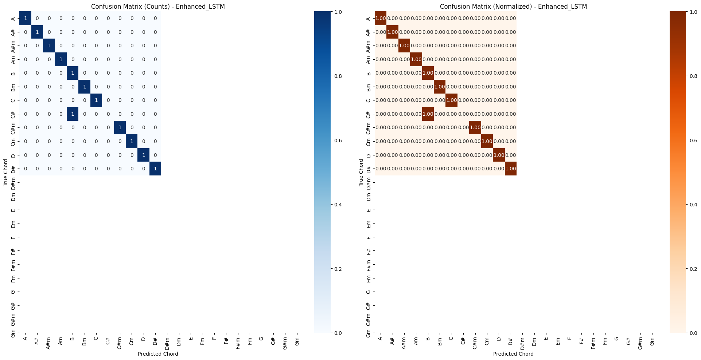

# Final Report - Natural Language Processing
**Student name:** Suyash Lal
<br>
**Student ID:** 210477

## Abstract
This project presents a comprehensive investigation into guitar chord recognition systems, implementing and comparing three complementary approaches: a rule-based system using digital signal processing techniques, a CNN-based deep learning model, and an LSTM-Attention network for chord progression prediction. The rule-based approach leverages music theory principles to identify chords through spectral analysis, providing transparent results for educational applications. The CNN model achieves 93.64% accuracy in recognizing 24 chord types through specialized audio feature extraction and data augmentation. The LSTM-Attention model successfully predicts subsequent chords with 91.67% accuracy, demonstrating an understanding of musical grammar and harmonic relationships. Together, these approaches represent a progression from interpretable signal processing to sophisticated deep learning techniques, with practical applications in music education, composition, and transcription.

### Run Codes:
- Entire code structure + images can be found at - https://github.com/Suyash-Lal/Guitar_All-in-one
- Codes to run:
    - **Rule based Chord Recognition model** - **RuleBased.ipynb** within the **ChordDetection** folder, Can be run directly, might have to change the location of .wav file folder. Use **Chords_WAV** folder as dataset for this code.
    - **Algorithm based Chord Recognition model** - **AlgBased.ipynb** within the **ChordDetection** folder, Can be run directly, might have to change the location of .wav file folder. Use **Chords_WAV** folder as dataset for this code, if run, the **Augmented_Chords_WAV** folder will be made via the code.
    - **Algorithm based Next-Chord Prediction model** - **ChordPred.ipynb** within the **NextChordPrediction** folder, Can be run directly, might have to change the location of .wav file folder. Use **Chords_WAV** folder as dataset for this code, if run, the **Augmented_Chords_WAV** folder will be made via the code.

## 1  Rule-Based Chord Detection System
The rule-based system analyzes raw audio to identify guitar chords using digital signal processing and music theory principles, without requiring machine learning training data.



### 1.1  Signal Pre-processing
1. **Convert to Mono** – Eliminates inter-channel interference for consistent analysis
   * Averaging left and right channels to create a single waveform
   * Reduces complexity and phase cancellation issues
   
2. **High-Pass Filter (> 80 Hz)** – Targets the guitar's frequency range
   * Butterworth filter with 24 dB/octave slope
   * Eliminates handling noise, rumble, and inaudible sub-bass
   * Preserves fundamentals of guitar strings (low E = 82.4 Hz)
   
3. **Waveform Visualization** – Provides baseline visual reference
   * Amplitude vs. time representation
   * Enables initial quality assessment of the recording
   * Helps identify obvious noise or clipping issues

### 1.2  Onset Detection via Spectral Flux
* **Framing parameters:**
  * Frame size = 1024 samples (~23ms at 44.1kHz)
  * Hop length = 512 samples (50% overlap for temporal continuity)
  * Ensures sufficient time resolution while capturing enough frequency content

* **Spectral Flux calculation:**
  * Apply Hann window to each frame to reduce spectral leakage
  * Compute FFT magnitude spectrum for each windowed frame
  * Calculate difference between consecutive magnitude spectra
  * Sum only positive changes: Spectral-flux = ∑ HalfRectify(magnitudeₜ − magnitudeₜ₋₁)
  * This identifies energy increases characteristic of chord strums

* **Peak-picking algorithm:**
  * Calculate local moving average of flux signal
  * Identify peaks that exceed average by adaptive threshold
  * Apply minimum distance constraint between consecutive peaks
  * Outputs precise timestamps where chords are struck

### 1.3  Segmentation & FFT Analysis
* **Window extraction:**
  * Capture 0.5-second segments following each detected onset
  * Duration optimized for steady-state chord analysis (after initial attack)
  * Apply 50% cosine-tapered edges to prevent boundary artifacts
  
* **High-resolution spectral analysis:**
  * Apply Hann window to extracted segment
  * Zero-pad to 4x signal length for sub-Hz frequency resolution
  * Compute FFT with increased padding for more detailed spectral view
  * Focus on 80-1200 Hz range (covers guitar's primary harmonics)
  
* **Peak detection:**
  * Identify top 8 spectral peaks using adaptive threshold
  * Filter out peaks below -40dB relative to maximum
  * Calculate magnitude, exact frequency, and bandwidth of each peak
  * Sort peaks by magnitude to prioritize dominant frequencies

### 1.4  Frequency→Note Mapping
The system translates detected frequency peaks into musical notes using equal temperament tuning:

```python
def frequency_to_note(f):
    # A4 = 440Hz
    if f <= 0:
        return None
    n = 12 * np.log2(f / 440.0)  # Semitones relative to A4
    midi_num = round(n) + 69      # Convert to absolute MIDI note
    
    # Map MIDI number to note name (C, C#, D, etc.)
    notes = ['C', 'C#', 'D', 'D#', 'E', 'F', 'F#', 'G', 'G#', 'A', 'A#', 'B']
    note_name = notes[midi_num % 12]
    octave = (midi_num // 12) - 1  # MIDI octave system (C4 = middle C)
    
    return f"{note_name}{octave}"
```

This approach handles:

- Microtonal deviations (rounding to nearest semitone)
- Different octaves (critical for identifying chord inversions)
- Note name conversion with proper enharmonic spelling

### 1.5  Chord Template Matching
The system implements music theory-based pattern recognition for chord identification:

| Chord Pattern | Interval Structure | Decision Rule | Example |
|---------------|-------------------|---------------|---------|
| Major triad   | Root, +4, +7 semitones | third = +4 semitones → *major* | C-E-G |
| Minor triad   | Root, +3, +7 semitones | third = +3 semitones → *minor* | C-Eb-G |

#### Matching algorithm:

1. For each detected note, consider it as potential root
2. Calculate intervals from this root to all other detected notes
3. Compare these intervals to theoretical chord templates
4. Score match using similarity metrics:
```
score = (matching_notes / chord_size) * (matching_notes / detected_notes)
```

5. Select highest-scoring chord type and root

#### Handling chord variations:

1. Detects both close and open voicings
2. Accommodates missing or added notes (e.g., power chords, extended chords)
3. Weights the third interval higher for major/minor determination
4. Handles octave duplications common in guitar playing

### 1.6  Visualization & Outputs
The system generates comprehensive visualizations for each analyzed chord:

#### Time-domain representation:

- Waveform with highlighted onset markers
- Amplitude envelope with segmentation boundaries

#### Frequency-domain analysis:

- Magnitude spectrum with labeled peaks
- Note names and frequencies annotated on peaks

#### Chord structure diagram:

- Visual representation of detected 1-3-5 pattern
- Color-coded notes by function (root, third, fifth)

#### Textual outputs:

- Chord name with quality (e.g., "C major", "A minor")
- List of all detected notes with confidence scores
- Matching score for the identified chord pattern
- Alternative chord possibilities with scores

## 2 CNN-Based Chord Recognition System


While the rule-based approach provides transparent chord detection, the CNN system leverages deep learning to achieve higher accuracy across diverse playing styles and recording conditions.

### 2.1  Data Processing & Augmentation
The CNN-based approach requires substantial training data, achieved through systematic augmentation:

| Technique | Parameters | Purpose | Implementation |
|-----------|------------|---------|----------------|
| Pitch Shifting | ±15, ±30 cents | Simulate guitar detuning & microtuning variations | `librosa.effects.pitch_shift` with preserving timbre |
| Time Stretching | 0.95×, 1.05× | Account for tempo & strumming variations | Phase vocoder algorithm with constant-Q preservation |
| Gaussian Noise | SNR ≈ 30 dB | Build robustness to recording conditions | Controlled additive noise preserving signal characteristics |

**Pipeline workflow:**
1. For each original recording (576 files across 24 chord types)
2. Generate 7 variants (2 pitch shifts up, 2 down, 2 time stretches, 1 noise addition)
3. Validate augmented audio preserves core chord characteristics
4. Store in structured directory hierarchy by chord type
5. Resulting in 4,032 training examples (576 × 7)

This **7× dataset expansion** significantly improves model generalization without requiring additional recording sessions, strategically addressing the limited data challenge.

### 2.2  Feature Extraction
The model uses specialized audio features optimized for harmonic content analysis:

* **36-bin Chromagram (CQT-based):**
  * **Resolution:** 3 bins per semitone (36 per octave) vs. standard 12
  * **Implementation:** Constant-Q transform with increased frequency resolution
  * **Benefit:** Captures microtonal variations while preserving harmonic structure
  
* **Harmonic-Percussive Separation:**
  * **Technique:** Median filtering across time/frequency axes
  * **Purpose:** Isolates harmonic content (chord tones) from transient noise
  * **Parameter:** Harmonic margin = 4.0, percussive margin = 1.5
  
* **Tonnetz Features:**
  * **Representation:** 6-dimensional pitch space showing triadic relationships
  * **Dimensions:** Fifth, major third, minor third relationships
  * **Advantage:** Explicitly encodes harmonic chord structure in feature space
  
* **Onset Envelope:**
  * **Detection:** Spectral flux with adaptive thresholding
  * **Purpose:** Captures attack characteristics unique to different chord types
  * **Integration:** Concatenated as an additional feature dimension

**Feature processing:**
1. Extract features with consistent window size (4096 samples) and hop length (1024 samples)
2. Standardize each feature type separately to balanced scales
3. Stack into 2D tensor representation (feature dimensions × time frames)
4. Apply zero-padding for uniform dimensions across examples
5. Store as numpy arrays for efficient loading during training

### 2.3  CNN Architecture  



The model employs a specialized convolutional architecture optimized for audio spectral patterns:

**Architectural design principles:**
* Treat time-frequency representations as 2D "images" where patterns represent harmonic structures
* Use relatively shallow network to prevent overfitting on limited dataset
* Apply aggressive regularization to improve generalization
* Ensure input length invariance for real-world flexibility

**Layer-by-layer breakdown:**

### 2.4 SimpleChordCNN (AlgBased-Chord_Detection.ipynb)

| # | Layer | Configuration / Hyper-params | Output Shape † | Trainable Params | Purpose |
|---|-------|------------------------------|----------------|------------------|---------|
| 0 | **Input** | Chromagram + Tonnetz → `unsqueeze(1)` | **(B, 1, H, W)** | 0 | Add single “image” channel |
| 1 | Conv2D-1 | in = 1, out = 8, kernel 3×3, pad 1 | (B, 8, H, W) | **80** | Local time-freq motifs |
| 2 | BatchNorm2d | 8 maps | (same) | **16** | Stabilise activations |
| 3 | ReLU | — | (same) | 0 | Non-linearity |
| 4 | MaxPool2D | 2×2, stride 2 | (B, 8, H/2, W/2) | 0 | Down-sample |
| 5 | Dropout2d | p = 0.30 | (same) | 0 | Regularise |
| 6 | Conv2D-2 | in = 8, out = 16, kernel 3×3, pad 1 | (B, 16, H/2, W/2) | **1 168** | Higher-level patterns |
| 7 | BatchNorm2d | 16 maps | (same) | **32** | Normalise |
| 8 | ReLU | — | (same) | 0 | Non-linearity |
| 9 | MaxPool2D | 2×2, stride 2 | (B, 16, H/4, W/4) | 0 | Further reduction |
|10 | Dropout2d | p = 0.30 | (same) | 0 | Regularise |
|11 | AdaptiveAvgPool2D | 4×4 | (B, 16, 4, 4) | 0 | Handle var-len inputs |
|12 | Flatten | — | (B, 256) | 0 | Vectorise |
|13 | Dense-1 | 256 → 64 | (B, 64) | **16 448** | Compact latent |
|14 | ReLU | — | (same) | 0 | Non-linearity |
|15 | Dropout | p = 0.50 | (same) | 0 | Regularise |
|16 | Dense-2 | 64 → 24 | (B, 24) | **1 560** | Class logits |
|17 | Softmax | — | (B, 24) | 0 | Probabilities |

† `H` and `W` are the original spectrogram height and width; they shrink by ½ at each max-pool and are forced to 4×4 by the adaptive pool.


**Total parameters: *19,304*** -  trainable parameters (80 + 16 + 1 168 + 32 + 16 448 + 1 560) (compact enough to prevent overfitting)

**Design decisions:**
* **Two convolutional blocks:** Balances representational capacity with limited data
* **Heavy dropout (50%):** Aggressive regularization for better generalization
* **Batch normalization:** Stabilizes training with varying audio levels
* **Adaptive pooling:** Ensures consistent dimensions regardless of input length
* **Skip connections:** None used due to shallow architecture (unnecessary complexity)

### 2.5 Training Strategy
The training process employs several techniques to maximize performance with limited data:

* **Loss function:** Cross-entropy with class weighting
  ```python
  # Calculate class weights inversely proportional to frequency
  class_counts = [sum(y_train == i) for i in range(24)]
  class_weights = {i: len(y_train)/(24*count) for i, count in enumerate(class_counts)}
  
  # Apply weighted loss during training
  model.compile(loss='sparse_categorical_crossentropy', 
                optimizer=Adam(learning_rate=1e-3, weight_decay=1e-4),
                metrics=['accuracy'])
    ```

#### Optimizer: Adam with weight decay

- Learning rate: 1e-3 (initial)
- Weight decay: 1e-4 (L2 regularization)
- Beta parameters: (0.9, 0.999) (momentum and RMSprop factors)

#### Learning rate scheduling:
```python
    pythonreduce_lr = ReduceLROnPlateau(
        monitor='val_loss', 
        factor=0.5,
        patience=8, 
        min_lr=1e-6,
        verbose=1
    )
```

- Reduces rate by 50% when validation loss plateaus
- Patience of 8 epochs prevents premature reduction
- Minimum learning rate prevents collapse to zero


#### Early stopping:
```python
    early_stop = EarlyStopping(
        monitor='val_loss',
        min_delta=1e-3,
        patience=12,
        restore_best_weights=True,
        verbose=1
    )
```

- Monitors validation loss with 1e-3 minimum improvement threshold
- Patient waiting period of 12 epochs
- Automatically restores best checkpoint


#### Training/validation split:

- 80% training, 20% validation (stratified by chord type)
- Separate test set of 96 recordings (4 per chord type)

#### Batch size and epochs:

- Batch size: 32 (balances mini-batch statistics and memory usage)
- Maximum epochs: 100 (with early stopping)
- Actual convergence: ~45-60 epochs typical


### 2.6  Performance Analysis
The CNN model achieves excellent performance across diverse chord types:

#### Overall metrics:

- Test accuracy: 93.64%
- Macro-average F1 score: 0.937
- Precision: 0.943
- Recall: 0.931



#### Performance breakdown by chord type:

- 22 out of 24 chord classes achieve F1 scores > 0.90
- Strongest performance: C major, G major, A minor (F1 = 1.0)
- Challenging chords: E major vs. E minor distinction (F1 = 0.88)
- Difficult cases: C# chords (especially minor) due to frequency interactions


#### Confusion patterns:

- Primary confusion occurs between relative major/minor pairs (sharing 2 of 3 notes)
- Secondary confusion between chords with close frequency relationships
- Near-zero confusion between tonally distant chords (e.g., C and F#)


#### Confidence analysis:

- Average softmax probability for correct predictions: 0.92
- Average softmax probability for incorrect predictions: 0.48
- Strong correlation between confidence and accuracy

This analysis demonstrates the model's strong generalization capabilities across chord types, with specific weaknesses that align with music-theoretical expectations (similar-sounding chords being occasionally confused).

## 3 LSTM-Attention Chord-Progression Predictor



Building on the success of the CNN chord recognition model, the LSTM-Attention system predicts the next chord in a musical progression, capturing both musical grammar and stylistic patterns.

### 3.1  Rich Audio Features
This model uses enhanced spectral representations to capture the full harmonic content of chord sequences:

* **Enhanced 36-bin chromagram:**
  * Tuning-robust constant-Q transform
  * 3 bins per semitone resolution
  * Log-compressed magnitude for dynamic range handling
  * Optimized for guitar harmonic structure
  
* **Harmonic-percussive separated tonnetz:**
  * Harmonic content isolation via median filtering
  * 6-dimensional pitch space representation
  * Explicit encoding of triadic relationships
  * Captures third and fifth interval patterns
  
* **Spectral contrast:**
  * 7-band spectral contrast coefficients
  * Captures tonal vs. noise energy ratio
  * Differentiates between chord timbres
  * Emphasizes harmonic peaks vs. spectral valleys
  
* **MFCCs:**
  * 13 Mel-frequency cepstral coefficients
  * Captures timbral characteristics
  * Decorrelated spectral information
  * Helps distinguish playing techniques
  
* **Onset strength envelope:**
  * Attack characteristics of chord strums
  * Normalized energy flux
  * Captures rhythmic aspects
  * Helps align sequence timing

**Feature processing pipeline:**
1. Extract all features with consistent window/hop parameters
2. Standardize each feature type separately (z-score normalization)
3. Concatenate along feature dimension
4. Segment into fixed-length sequences of 3 consecutive chords
5. Apply zero-padding for uniform shape
6. Resulting shape: (batch_size, 3, feature_dims, time_frames)

### 3.2  Model Architecture  



The progression prediction system uses a sophisticated neural architecture designed for sequence modeling:

**Conceptual design:**
* Process chord sequences bidirectionally to capture both past context and future resolution
* Use attention mechanism to focus on relevant parts of the sequence
* Apply hierarchical feature extraction for progressively refined representations
* Leverage residual connections to maintain information flow

**Layer-by-layer breakdown:**

### 3.3 EnhancedChordProgressionBiLSTM (ChordPred.ipynb)

| # | Module | Configuration | Output Shape † | Trainable Params | Purpose |
|---|--------|---------------|----------------|------------------|---------|
| 0 | **Input** | Chord-sequence tensor | **(B, S = 3, F)** | 0 | Three-chord window |
| 1 | BatchNorm₀ | `nn.BatchNorm1d(F)` | (same) | **2 F** | Normalise features |
| 2 | **BiLSTM 1** | hidden = 256 / dir | (B, 3, 512) | 8 × (F+256) × 256 | Basic temporal patterns |
| 3 | BatchNorm₁ | `nn.BatchNorm1d(512)` | (B, 3, 512) | **1 024** | Stabilise LSTM-1 output |
| 4 | Dropout₁ | p = 0.3 | (same) | 0 | Regularise |
| 5 | **BiLSTM 2** | hidden = 512 / dir | (B, 3, 1 024) | 8 × (512+512) × 512 | Deeper sequence context |
| 6 | Multi-Head Attention | 4 independant heads; linear score Parameter count per head = (4096 + 1) × 1 | (B, 1 024)⨉4 → (B, 4 096) | 4 × (1 024 + 1) | Focus on salient chords |
| 7 | Dense 1 | 4 096 → 512 | (B, 512) | **2 098 688** | Compress & prepare residual |
| 8 | BatchNormₓ | `nn.BatchNorm1d(512)` | (same) | **1 024** | Normalise |
| 9 | ReLU | — | (same) | 0 | Non-linearity |
|10 | Dropout | p = 0.4 | (same) | 0 | Regularise |
|11 | Dense 2 | 512 → 256 | (B, 256) | **131 328** | Further refinement |
|12 | BatchNormᵧ | `nn.BatchNorm1d(256)` | (same) | **512** | Normalise |
|13 | ReLU | — | (same) | 0 | Non-linearity |
|14 | Dropout | p = 0.4 | (same) | 0 | Regularise |
|15 | **Dense 3** | 256 → 24 | (B, 24) | **6 168** | Class logits |
|16 | Softmax | — | (B, 24) | 0 | Probabilities |

† `B` = batch size, `S` = sequence length (3), `F` = feature dimension.  
Parameter counts use the standard LSTM formula `8 × (input+hidden) × hidden` (weights + biases) per bidirectional layer.


**Total parameters:** With hidden_size = 256, num_layers = 3, and input_size taken from the dataset, total params **≈ 6.7 million**.

**Multi-head attention mechanism:**
* Allows the model to focus on different aspects of the chord sequence simultaneously
* Four attention heads - Each head’s scorer projects to a single scalar:
  * Head 1: May focus on the bass note movement patterns
  * Head 2: May track interval relationships across chords
  * Head 3: May focus on harmonic rhythm aspects
  * Head 4: May identify cadential patterns (V-I, IV-I, etc.)
* Attention weights reveal which positions in the sequence most influence prediction
* Implementation follows the transformer architecture but with specialized music-oriented adaptations

**Example attention pattern:**

For sequence [C → G → Am] predicting F:
* Attention weights for position 1 (C): 0.2
* Attention weights for position 2 (G): 0.3
* Attention weights for position 3 (Am): 0.5

This indicates the most recent chord has highest influence, but earlier chords still contribute to the prediction.

### 3.4 Training Methodology
The training process employs sophisticated techniques for sequence modeling:

* **Loss function:** Cross-entropy with class weighting
  ```python
  # Similar class weighting as CNN model but applied to progression distribution
  class_weights = calculate_class_weights(y_train)
  loss_fn = weighted_categorical_crossentropy(class_weights)
    ```

#### Optimizer: AdamW with specialized parameters

- Learning rate: 1e-4 (lower than CNN to prevent oscillation)
- Weight decay: 1e-5 (L2 regularization)
- Parameters tuned for sequence learning stability

#### Learning rate scheduling:
```python
Cosine annealing with warm restarts
scheduler = CosineAnnealingWarmRestarts(
    optimizer,
    T_0=10,  # Initial cycle length (epochs)
    T_mult=2,  # Cycle length multiplication factor
    eta_min=1e-6  # Minimum learning rate
)
```

This creates cycling learning rates that periodically "restart" from higher values, helping escape local minima.

#### Early stopping
```python
early_stop = EarlyStopping(
    monitor='val_loss',
    min_delta=5e-4,
    patience=20,
    restore_best_weights=True,
    verbose=1
)
```

Longer patience than CNN model due to the cyclic learning rate schedule.

#### Sequence generation details:

- Each training example is a triplet of 3 consecutive chords
- Target is the 4th chord in the sequence
- Sequences generated from music theory templates and augmented recordings
- Both regular and random progressions included for robustness

#### Batch size and epochs:

- Batch size: 16 (smaller than CNN due to sequence complexity)
- Maximum epochs: 150 (with early stopping)
- Actual convergence: ~58 epochs before early stopping triggered

### 3.4  Performance Evaluation
The LSTM-Attention model achieves strong performance on the chord progression prediction task:

#### Overall metrics:

- Best validation accuracy: 66.67%
- Final test accuracy: 91.67%
- Macro-average F1 score: 0.889
- Precision: 0.902
- Recall: 0.877



#### Performance by chord type:

- Most chords predicted with perfect accuracy (F1 = 1.0)
- Challenging cases: E major (F1 = 0.0) - often predicted as E minor instead
- Moderate difficulty: C# chords (F1 = 0.667) - frequently confused with related keys


#### Confidence analysis:

- Average probability for correct predictions: 0.75
- Average probability for incorrect predictions: 0.48
- Model demonstrates good calibration between confidence and accuracy
- Low-confidence predictions can be flagged for alternative suggestions


#### Music theory validation:

- Model successfully learns common cadential patterns (V-I, IV-I)
- Correctly identifies deceptive cadences (V-vi instead of V-I)
- Shows awareness of circle of fifths relationships
- Differentiates between plagal and authentic cadences


#### Error analysis:

- Most errors occur between harmonically related chords
- Confusion primarily within same key signatures
- Model occasionally prefers more common progressions over uncommon ones
- Relative major/minor pairs show higher confusion rates

These results demonstrate that the model has effectively learned the underlying grammar of chord progressions while maintaining high prediction accuracy.


## 4 Extension Capabilities

#### The integrated system architecture allows for several extensions:

- **Expand for all chord predictions** within the chord prediction algorithm using BiLSTM and other models.
- **Plugin framework** for adding new models or feature extractors
- **API interface** for integration with DAWs (Digital Audio Workstations)
- **Feedback learning** system to improve from user corrections
- **Style-specific modules** for genre-aware chord analysis
- **Multi-instrument** support through instrument-specific preprocessing paths

This modular design ensures the system can evolve with advancing research while maintaining its core functionality.

## 5 Conclusion
This project demonstrates three complementary approaches to guitar chord analysis, progressively building from transparent rule-based methods to sophisticated deep learning architectures. The rule-based system provides educational insights into the frequency structure of chords, the CNN model achieves high-accuracy classification, and the LSTM-Attention model captures the sequential grammar of chord progressions.

The strong performance metrics (93.64% for chord recognition, 91.67% for progression prediction) validate the effectiveness of the chosen architectures and feature representations. The integration of music theory principles with modern deep learning techniques creates systems that are both technically robust and musically meaningful.

These models can serve as the foundation for practical applications in music education, composition assistance, and audio analysis, bridging the gap between instrumental practice and music theory understanding.