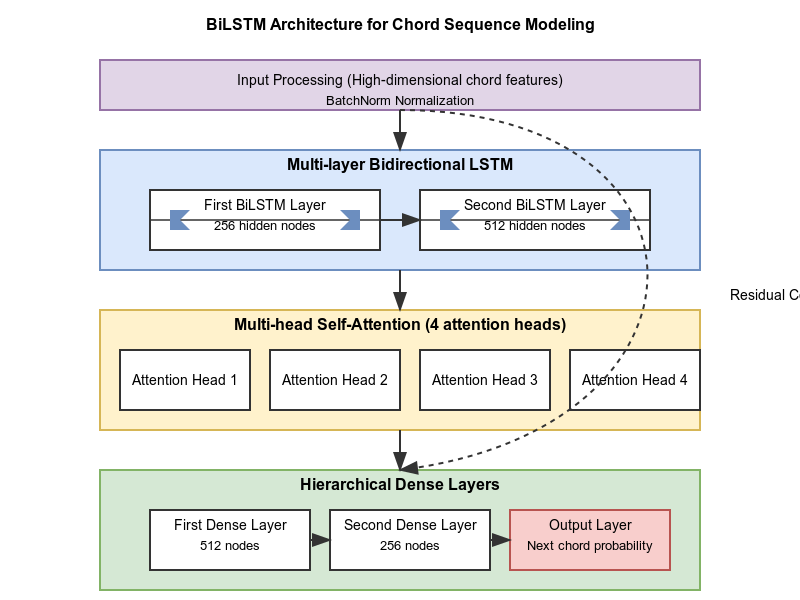

# Guitar Chord Progression Prediction Model: Implementation and Analysis

This code implements a **deep learning-based system** for predicting the next chord in a musical progression. Let me walk you through the important components and workflow:

## Dataset and Music Theory Foundation

The system uses a dataset of **576 guitar chord recordings** covering **24 chord types** - both major and minor chords across all 12 musical keys (A through G#). The data is organized with a strong music theory foundation:

- **Chord progressions** are generated based on standard music theory patterns
- The model learns to predict the most likely chord to follow a given sequence of chords
- This approach mirrors how musicians understand chord function and resolution in music

### Sequence construction (stored in .json)

How we build a training example:
- Take three consecutive chords (A → E → F#m).
- Stack their fingerprints into a little 3‑page booklet.
- Label the booklet with the chord that really came next (D).

Do that for hundreds of progressions so the model sees many patterns.

## Audio Feature Extraction

One of the most sophisticated aspects of the system is how it processes raw audio:

1. **Enhanced Chromagram** (36 bins per octave) captures detailed pitch content
2. **Harmonic-Percussive Separation** isolates harmonic content from noise/percussion
3. **Tonnetz Features** represent harmonic relationships between notes
4. **Spectral Contrast** captures timbral characteristics 
5. **MFCCs** provide additional timbral information
6. **Onset Detection** identifies attack characteristics of guitar chords

These features are standardized by feature type and padded to uniform length, creating a rich representation of each chord's acoustic properties.

## Model Architecture

The system uses an enhanced **LSTM (Long Short-Term Memory)** neural network architecture specifically designed for music sequence modeling.
 
Bidirectional Long Short-Term Memory networks process sequential data by maintaining memory cells that can remember or forget information over time. Unlike standard recurrent networks, LSTMs use specialized gating mechanisms to control information flow, while the bidirectional design processes sequences in both forward and backward directions. This allows BiLSTMs to capture both past context and future resolution—essential for modeling musical chord progressions where harmony depends on directional relationships.

- **Input Processing**: High-dimensional chord features are normalized via BatchNorm
- **Multi-layer Bidirectional LSTM**:
  - Processes chord sequences in both forward and backward directions
  - First layer extracts fundamental patterns with 256 hidden neurons
  - Second layer captures higher-level musical structures with 512 hidden neurons
  - Bidirectional design captures both past context and future resolution

- **Multi-head Self-Attention**: Four parallel attention mechanisms allow the model to:
    - Focus on different aspects of the chord sequence simultaneously
    - Weight the importance of each position in the sequence
    - Learn different harmonic relationships (e.g., cadences, voice leading)

        - C → G → Am → ?
        - [C, G, Am] → attention mechanism says: 
        - Am = 0.5, G = 0.3, C = 0.2

    - Heads:
        - Head 1: focus on the last chord’s bass note
        - Head 2: look at intervals across the whole sequence
        - Head 3: zoom in on rhythmic similarity
        - Head 4: check for cadence patterns like G → C
    - Then it combines all 4 perspectives into one smart, fused understanding of the input sequence.

- **Residual Connections**: Connect earlier and later layers to improve gradient flow
- **Hierarchical Dense Layers**: Progressively refine representations:
  - First layer (512 neurons) integrates attention outputs
  - Second layer (256 neurons) creates compact representation
  - Output layer produces probability distribution over possible next chords

This architecture combines the temporal modeling strengths of LSTMs with the selective focus of attention mechanisms, making it ideal for modeling musical progressions where both local context and longer-range dependencies matter. The bidirectional approach is particularly valuable for music, where chord function often depends on both preceding and following musical context.
## Training Process

The training process uses several advanced techniques:

- **Class Weighting** compensates for imbalanced chord distributions
- **Cosine Annealing with Warm Restarts** schedules learning rate changes
- **Early Stopping** prevents overfitting by monitoring validation performance
- **Gradient Clipping** prevents unstable gradient updates

The model trains for **58 epochs** before early stopping occurs, with the best validation accuracy at **66.67%**.

## Results and Performance

The final model achieves **91.67% accuracy** on the test set, which is excellent for this musical task. Key findings:

- Most chords are predicted with **perfect precision and recall** (F1 scores of 1.0)
- The model struggles most with the **E chord** (F1 score of 0.0) and has some difficulty with **C#** (F1 score of 0.6667)
- The model shows significantly higher confidence when making correct predictions (**0.75**) compared to incorrect ones (**0.48**)

The confusion matrices visualize where the model succeeds and where it makes mistakes, giving insights into which chord relationships might be more challenging to learn.
